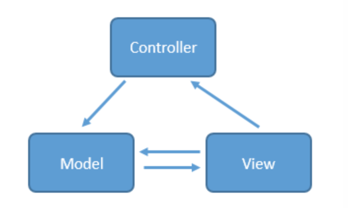
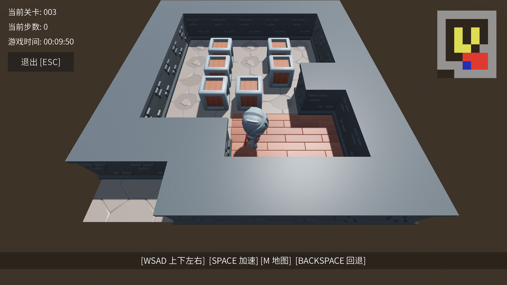

# Godot MVC
Lightweight mvc framework written with gdscript.



# Features

- Lightweight and non-intrusive.
- Independent of Node components.
- Support serialization and deserialization.
- Easy to use.

# How To Use

- Copy the 'mvc' directory to any location within your Godot project.
- Begin your MVC coding journey with the following code:

```gdscript

# create mvc app
var app = MVCApp.new()

# add proxy (model proxy)
app.add_proxy("p1", MVCProxy.new(1))
app.add_proxy("p2", MVCProxy.new(2))
app.add_proxy("p3", MVCProxy.new(3))

# add handler (controller)
app.add_handler("h1", MVCHnadler.new())
app.add_handler("h2", MVCHnadler.new())
app.add_handler("h3", MVCHnadler.new())

# add command
app.add_command("my_command", MVCCommand)

# send notification
app.notify("my_notification", with_param)
app.notify("my_command", with_param)

# get proxy
var p1: MVCProxy = app.get_proxy("p1")
print( p1.data() )

```

# Game made with this framework

### Godot Sokoban



#### Source Code
[https://godotengine.org/asset-library/asset/3390](https://godotengine.org/asset-library/asset/3390)